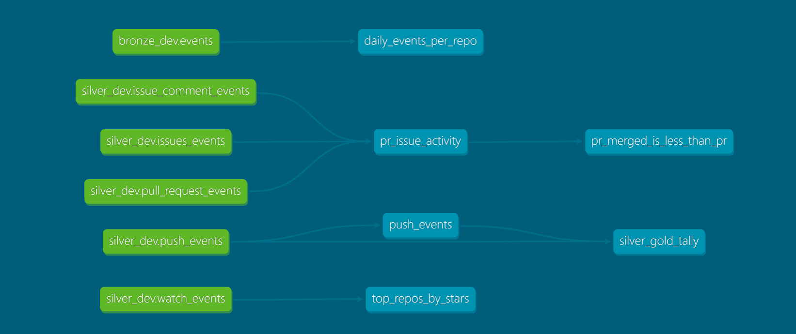

# GH Archive Ingestion Pipeline (databricks_gharchive)

Medallion-architecture pipeline on Databricks, ingesting 7 days of GH Archive event data (2020-06-08 to 2020-06-14) through Bronze, Silver, and Gold layers.

## What this proves
- Incremental/partition-based PySpark ingestion (not full-table rewrites)
- Nested/mixed-schema JSON handling across 5+ GitHub event types
- Unity Catalog dev/prod schema separation
- dbt-based Gold layer with schema + singular tests

## Architecture

**Bronze** (`gharchive.bronze_dev.events`) — raw events, all types mixed, payload kept as untouched string. Partitioned by `event_date`, idempotent via `replaceWhere`.

**Silver** (`gharchive.silver_dev`) — 5 tables, one per event type (PushEvent, PullRequestEvent, IssuesEvent, WatchEvent, IssueCommentEvent), payload flattened per type.

**Gold** (`gold/` dbt project) — 4 marts: `top_repos_by_stars`, `daily_events_per_repo`, `pr_issue_activity`, `push_events`. See ARCHITECTURE.md for why each mart's grain and source differ.

Full reasoning, decisions, and known data gaps: see [ARCHITECTURE.md](./ARCHITECTURE.md).

## Data
- Source: [gharchive.org](https://www.gharchive.org/), 168 hourly gzipped JSON files
- ~15.8M Bronze rows across 7 dates
- Known gap: 2020-06-10 missing 10/24 hours (confirmed GH Archive source outage — not a pipeline bug)

## Tech stack
Databricks Free Edition (Serverless), PySpark, Delta Lake, Unity Catalog, dbt-databricks, GitHub Actions

## How to run
### Prerequisites (manual, one-time)
1. Create catalog `gharchive` in Unity Catalog
2. Create schema `gharchive.bronze_dev` and Volume `landing_files` inside it
   (`silver_dev` / `silver_prod` schemas are created automatically by the Silver notebook)

### 1. Download raw data — `notebooks/01_explore.py`
Downloads 168 hourly gzipped JSON files (7 days × 24 hours) from gharchive.org into
`/Volumes/gharchive/bronze_dev/landing_files/`. Includes a missing-file check —
2020-06-10 will show 10 missing files (confirmed source outage, not a bug).

### 2. Build Bronze — `notebooks/02_bronze.py`
Reads raw JSON as text (not `spark.read.json` — see ARCHITECTURE.md for why),
extracts 10 fields via `get_json_object`, casts types, derives `event_date`,
and writes to `gharchive.bronze_dev.events`, partitioned and idempotent via
`replaceWhere`. The final cell loops over all 7 dates to backfill the full table.

### 3. Build Silver — `notebooks/03_silver.py`
Reads from `gharchive.bronze_dev.events`, splits into 5 event-type tables
(PushEvent, PullRequestEvent, IssuesEvent, WatchEvent, IssueCommentEvent),
flattens each payload shape, writes to `gharchive.silver_dev`, partitioned
and idempotent via `replaceWhere`.

### 4. Build Gold — `gold/` (dbt project)
cd gold/
dbt run
dbt test
dbt docs generate
dbt docs serve

## Tests
Gold layer: 21 dbt tests (schema + singular), PASS=21 ERROR=0.

## CI/CD
[FILL IN once you confirm the CI check — dbt build on push/PR only, not scheduled]